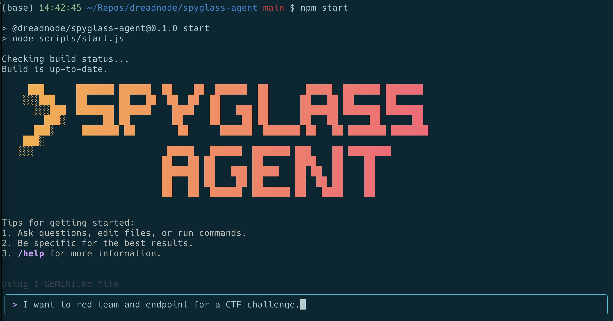

# Spyglass Agent - Red Team CLI Tool

[](https://github.com/google-gemini/gemini-cli/actions/workflows/ci.yml)



This repository contains Spyglass Agent, a command-line AI workflow tool designed specifically for red teaming and offensive security operations. Built on a foundation adapted from Google's Gemini CLI, it integrates with Claude AI to provide intelligent assistance for security testing workflows.

With Spyglass Agent you can:

- Analyze large codebases for vulnerability discovery and security assessments.
- Generate security reports and documentation from assessment findings.
- Automate red teaming tasks, like reconnaissance, vulnerability scanning, and exploit research.
- Use tools and MCP servers to connect specialized security capabilities and frameworks.
- Conduct context-aware security analysis with multi-modal capabilities.
- Integrate with existing security tools and workflows.

**Important**: This tool should only be used for authorized security testing and educational purposes. Ensure you have proper authorization before conducting any security assessments.

## Quickstart

1. **Prerequisites:** Ensure you have [Node.js version 18](https://nodejs.org/en/download) or higher installed.
2. **Run the CLI:** Execute the following command in your terminal:

   ```bash
   npx https://github.com/dreadnode/spyglass-agent
   ```

   Or install it with:

   ```bash
   npm install -g @dreadnode/spyglass-agent
   spyglass
   ```

3. **Pick a color theme**
4. **Authenticate:** When prompted, configure your Claude AI credentials for secure access to advanced AI capabilities optimized for security analysis.

You are now ready to use Spyglass Agent for your authorized security testing!

### Use a Claude API key:

The Claude API provides advanced reasoning capabilities ideal for security analysis:

1. Generate a key from [Anthropic Console](https://console.anthropic.com/).
2. Set it as an environment variable in your terminal. Replace `YOUR_API_KEY` with your generated key.

   ```bash
   export CLAUDE_API_KEY="YOUR_API_KEY"
   ```

3. Configure your usage tier based on your security testing requirements.

For other authentication methods and security configurations, see the [authentication](./docs/cli/authentication.md) guide.

## Examples

Once the CLI is running, you can start conducting security analysis with Claude from your shell.

You can start a security assessment from a target directory:

```sh
cd target-application/
spyglass
> Analyze this codebase for common security vulnerabilities and provide a prioritized list
```

Or work with an existing security project:

```sh
git clone https://github.com/target-org/webapp
cd webapp
spyglass
> Generate a comprehensive security assessment report for this web application
```

### Next steps

- Learn how to [contribute to or build from the source](./CONTRIBUTING.md).
- Explore the available **[CLI Commands](./docs/cli/commands.md)**.
- If you encounter any issues, review the **[Troubleshooting guide](./docs/troubleshooting.md)**.
- For more comprehensive documentation, see the [full documentation](./docs/index.md).
- Take a look at some [security-focused tasks](#security-focused-tasks) for more inspiration.

### Troubleshooting

Head over to the [troubleshooting](docs/troubleshooting.md) guide if you're
having issues.

## Security-focused tasks

### Vulnerability discovery and analysis

Start by `cd`ing into a target codebase and running `spyglass`.

```text
> Identify potential SQL injection vulnerabilities in this codebase and suggest remediation strategies.
```

```text
> Analyze the authentication mechanisms for security weaknesses and privilege escalation paths.
```

### Security assessments and reporting

```text
> Create a comprehensive penetration testing report based on my findings in issues #45-67.
```

```text
> Help me develop a security remediation plan for the vulnerabilities identified in this audit.
```

### Red team automation

Use MCP servers to integrate specialized security tools with your assessment workflows.

```text
> Automate reconnaissance of this target domain and generate an attack surface analysis.
```

```text
> Create a dashboard showing vulnerability trends across our recent assessments.
```

### Security tool integration

```text
> Parse these Nmap scan results and identify the most promising attack vectors.
```

```text
> Analyze these log files for indicators of compromise and generate an incident timeline.
```

### Responsible disclosure and documentation

```text
> Generate a properly formatted vulnerability disclosure report for this critical finding.
```

```text
> Create documentation for this security tool integration following responsible disclosure guidelines.
```

## Purpose & Scope

This tool is designed exclusively for **defensive security purposes**, including:
- Security assessment and penetration testing
- Vulnerability research and analysis  
- Red team exercises and training
- Security tool automation and integration
- Defensive posture evaluation

**Always ensure proper authorization before testing and follow responsible disclosure practices.**

### Uninstall

Head over to the [Uninstall](docs/Uninstall.md) guide for uninstallation instructions.

## Terms of Service and Privacy Notice

For details on the terms of service and privacy notice applicable to your use of Spyglass Agent, see the [Terms of Service and Privacy Notice](./docs/tos-privacy.md).

